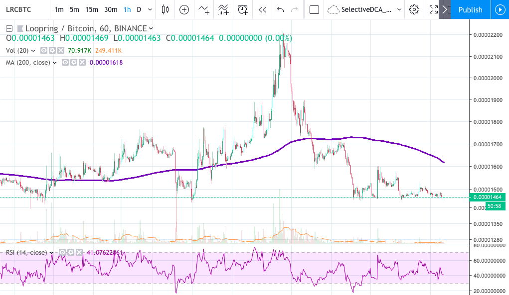

# SelectiveDCA Bot
A Dollar Cost Averaging (DCA) bot that does regular buys but opportunistically selects _which_ crypto to buy by comparing market conditions for all the assets in its user-set watchlist.


_DCA = Buy every X hours; SelectiveDCA = Buy the crypto furthest below its 200-hr MA every X hours_


## Overview
The Dollar Cost Averaging investment philosophy is the easiest "set it and forget it" approach there is and is quite FOMO-resistant. DCA requires a longer-term commitment; it doesn't matter if the market happens to be up or down today, DCA will keep buying in regardless.

While I love the simplicity of DCA, you do end up buying into inopportune random spikes like LRC's "here today, gone tomorrow" pump in the image above. In the long run the "Averaging" part of DCA will smooth the spikes and valleys out, but I was curious to see if there might be room for some slight improvements by employing a tiny bit more intelligence to the buying process. In short: don't buy into a spike. SelectiveDCA will still buy in on a regular schedule, but it has the flexibility to spend its money on what it thinks is the best opportunity at the moment.

_Big caveat: if the opportunity metric used isn't great, SelectiveDCA will, of course, make bad decisions._

## Details
The bot is given a watchlist of cryptos that it can select amongst. For each crypto on its watchlist it will grab the latest hourly candles and compute the 200-hr MA for each. The closing price of the most recently completed candle is then divided by the crypto's 200-hr MA:

```
for crypto in watchlist:
    # get most recent candle and compute 200-hr MA
    ...

    # now compute the price_to_ma percentage:
    price_to_ma = last_candle.close / ma_200hr
```

The resulting `price_to_ma` will determine our sense of how good or poor an investment opportunity it is at the moment. Low `price_to_ma` values mean that the current price is below the trend from the last 9 days. High `price_to_ma` values mean its on an uptrend. 

The crypto with the lowest `price_to_ma` will be the target for this round's DCA buy.

```
    LRC: close: 0.00001464 BTC | 200-hr MA: 0.00001621 | price-to-MA: 0.9034
    ICX: close: 0.00007160 BTC | 200-hr MA: 0.00007646 | price-to-MA: 0.9365
    ONT: close: 0.00025990 BTC | 200-hr MA: 0.00027287 | price-to-MA: 0.9525
    XLM: close: 0.00002258 BTC | 200-hr MA: 0.00002352 | price-to-MA: 0.9600
    ETH: close: 0.03215900 BTC | 200-hr MA: 0.03311498 | price-to-MA: 0.9711
    LTC: close: 0.01581300 BTC | 200-hr MA: 0.01625708 | price-to-MA: 0.9727
    AST: close: 0.00000835 BTC | 200-hr MA: 0.00000857 | price-to-MA: 0.9745
    WAN: close: 0.00008180 BTC | 200-hr MA: 0.00008274 | price-to-MA: 0.9887
    XMR: close: 0.01299200 BTC | 200-hr MA: 0.01313567 | price-to-MA: 0.9891
    EOS: close: 0.00105770 BTC | 200-hr MA: 0.00106117 | price-to-MA: 0.9967
    VET: close: 0.00000137 BTC | 200-hr MA: 0.00000137 | price-to-MA: 0.9997
    BAT: close: 0.00005902 BTC | 200-hr MA: 0.00005708 | price-to-MA: 1.0341
    BNB: close: 0.00374330 BTC | 200-hr MA: 0.00358123 | price-to-MA: 1.0453
```

## Philosophy
The core assumption here is that it's better to buy on the downtrends than when an asset is getting hot. Remember that we're starting from a hand-picked watchlist of cryptos; you should believe in the medium- to longer-term future of each crypto that you put on this list. That longer-term faith is what makes buying on the downtrends a reasonable play. 

And while the altcoin market does tend to ebb and flow together, they still seem to take their random turns driving suddenly up or down on their own. With a big enough collection of cryptos (8-10+) the hope is that you can take advantage of these random opportunities without having to keep an eye on everything yourself.

## Why 200-hr MA?
This is where the art and expertise come in (of which I claim neither). First of all I chose a metric on the hourly candles because I'll be running this SelectiveDCA Bot multiple times each day. Daily candles wouldn't have enough resolution while  5/15/30-min candles were more granular and more short-term than I wanted to be concerned with.

The 200-hr MA seemed to strike the right balance of reaction speed vs stability. If the period is too long, the MA shows after-effects long after a move happened and won't capture the current realities of the market. If the period is too short, the MA will be too tightly tied to the day's volatility (a minor pullback amidst a bigger move could seem like a bigger deal than it actually is).

Maybe an EMA would be better? Maybe 150 candles? To each his or her own.

## Disclaimer
_I built this to execute my own micro dollar cost-averaging crypto buys. Use and modify it at your own risk. This is also not investment advice. I am not an investment advisor. Always #DYOR - Do Your Own Research and invest in the way that best suits your needs and risk profile._


# Tips
If you found this useful, send me some digital love
- ETH: 0xb581603e2C4eb9a9Ece4476685f0600CeB472241
- BTC: 13u1YbpSzNsvVpPMyzaDAfzP2jRcZUwh96
- LTC: LMtPGHCQ3as6AEC9ueX4tVQw7GvHegv3fA
- DASH: XhCnytvKkV44Mn5WeajGfaifgY8vGtamW4
